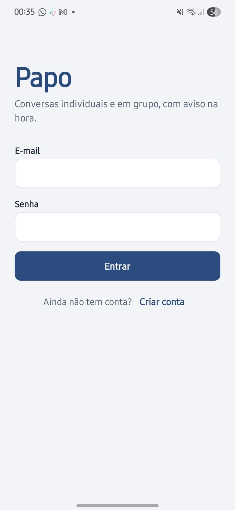
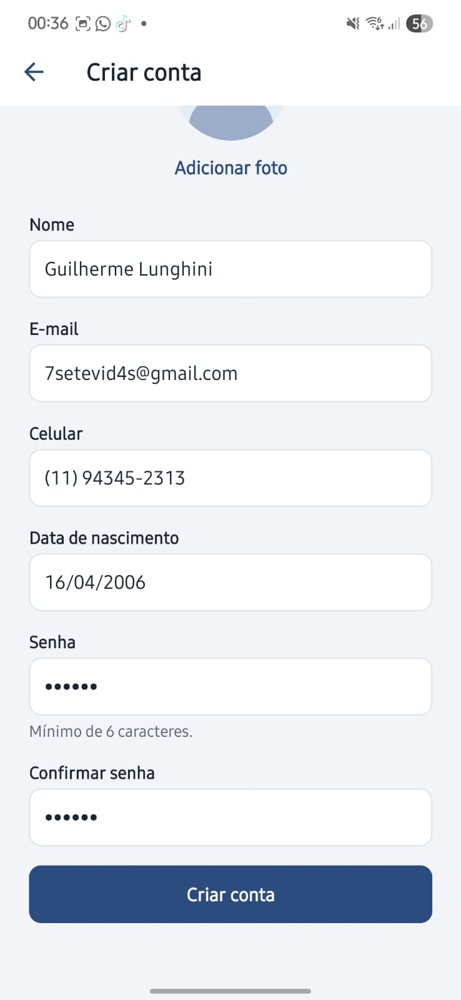
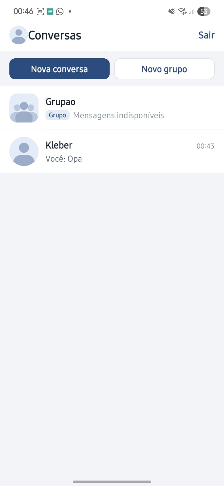
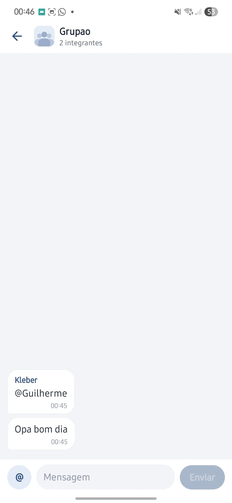
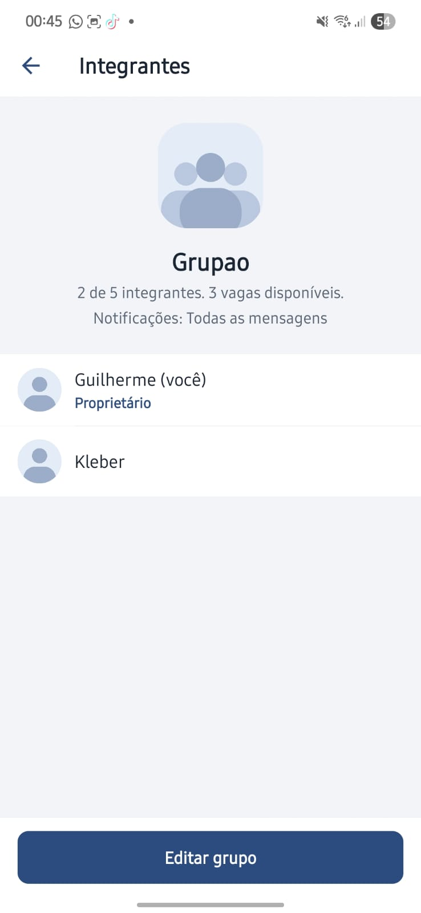
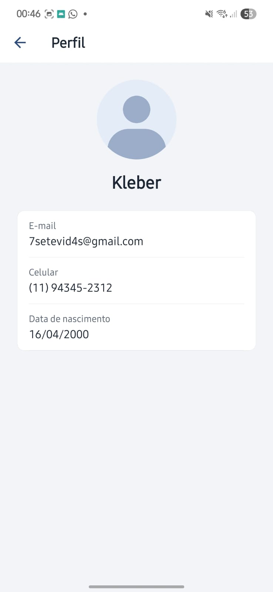
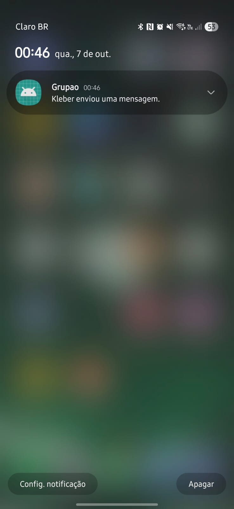
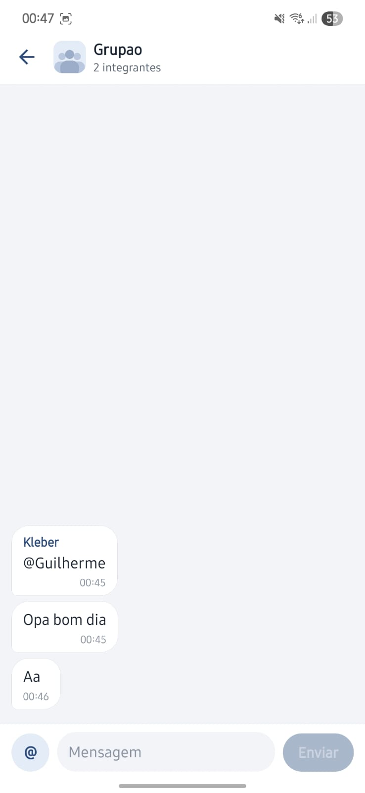

# Papo

Aplicativo de chat em React Native com conversas individuais e em grupo. Usa Firebase Authentication (e-mail e senha), Realtime Database para as mensagens, Cloud Firestore para perfis, grupos e configurações, e push notifications disparadas por uma API própria publicada na internet.

## Integrantes

- David Alexandre Cordeiro Paixão – RM 557538
- Guilherme Lunghini Teixeira – RM 556892
- Marchel Augusto Ribeiro de Matos – RM 99856-
- Tiago Morais Neto – RM 555619
- Vinicius Augusto Siqueira Gonçalves – RM 557065

## Links da entrega

- Repositório: https://github.com/glunghini/cp2-papo
- API online: https://papo-api.onrender.com
- Health check: https://papo-api.onrender.com/health

## Tecnologias

| Parte | Tecnologia |
|---|---|
| App | React Native 0.83, Expo SDK 55, TypeScript (strict, sem `any`) |
| Navegação | React Navigation 7 (native stack) |
| Autenticação | Firebase Authentication, apenas e-mail e senha |
| Mensagens | Firebase Realtime Database |
| Perfis, grupos, tokens | Cloud Firestore |
| Fotos | Firebase Storage |
| Push | Expo Notifications no app; Expo Push Service na API, que entrega via FCM no Android e APNs no iOS |
| API | Node.js 22, Express 5, Firebase Admin SDK, Zod |
| Hospedagem da API | Render (web service com HTTPS) |

Versão do Expo: SDK 55 (`expo ~55.0.0`).

## Responsabilidade de cada serviço

**Firebase Authentication** cria contas, faz login, mantém a sessão (persistida com AsyncStorage) e identifica cada pessoa pelo `uid`. O ID token gerado aqui é o que autentica as chamadas à API.

**Realtime Database** guarda todas as mensagens, individuais e de grupo, em `messages/{conversationId}/{messageId}`. A tela de chat mantém um listener (`onValue` com `limitToLast`) que é removido ao sair da tela ou trocar de conversa. Também existe o nó `conversationMembers/{groupId}/{uid}`, escrito somente pela API, que as regras usam para saber quem pode ler e escrever em cada grupo.

**Cloud Firestore** guarda:

- `users/{uid}`: nome, foto e data de criação (visível a usuários logados, para a lista de pessoas);
- `users/{uid}/private/profile`: e-mail, celular e data de nascimento (só o dono lê direto; outras pessoas leem pela API);
- `users/{uid}/devices/{deviceId}`: token de push, plataforma e se está ativo;
- `groups/{groupId}`: nome, foto, proprietário, integrantes, limite, política de notificação;
- `directConversations/{conversationId}`: os dois participantes de cada conversa individual;
- `notificationDispatches/{id}`: controle de idempotência do push (só a API acessa).

**Firebase Cloud Messaging** é o canal de entrega no Android. O app obtém o token com `expo-notifications`, que usa o SDK do FCM configurado pelo `google-services.json`. A API envia pelo Expo Push Service, que repassa ao FCM usando a credencial FCM v1 do projeto cadastrada no EAS. No iOS a entrega final é pelo APNs.

**Firebase Storage** guarda as fotos de perfil e de grupo. No Firestore fica só a URL de download.

## Estrutura do projeto

```text
.
├── App.tsx
├── app.json            configuração do Expo (plugins, FCM, projectId do EAS)
├── eas.json                 perfis de build
├── firebaseConfig.json      configuração do SDK cliente (sem segredos)
├── firebase.json            aponta para as regras abaixo
├── firebase/
│   ├── firestore.rules
│   ├── database.rules.json
│   ├── storage.rules
│   └── firestore.indexes.json
├── assets/                  imagens padrão de perfil e de grupo
├── src/
│   ├── components/          Avatar, ChatInput, ChatMessage, ConversationItem, GroupMemberItem...
│   ├── constants/           textos das políticas de notificação
│   ├── contexts/            AuthContext, NotificationContext
│   ├── hooks/               useAuth, useChat, useConversations, useGroups, useNotifications, useUsers
│   ├── navigation/          RootNavigator e referência global de navegação
│   ├── screens/             Login, Register, Conversations, Users, GroupForm, Chat, Profile, GroupMembers
│   ├── services/            firebase, apiClient, authService, userService, chatService,
│   │                        groupService, notificationService, storageService
│   ├── types/               user, chat, group, notification, navigation
│   └── utils/               conversationId, groupValidation, validation, errors, parse, format
├── server/
│   └── src/
│       ├── app.ts / server.ts
│       ├── config/env.ts
│       ├── middleware/      authenticate.ts, errorHandler.ts
│       ├── routes/          health, notifications, groups, users
│       └── services/        firebaseAdmin, recipientResolver, notificationSender,
│                            messageNotifications, dispatchLock, groupAdmin, profileAccess...
└── render.yaml              blueprint de deploy da API
```

## Como rodar o app

Pré-requisitos: Node 20 ou superior, conta no Expo (EAS) e um aparelho físico para testar o push.

```bash
npm install
npx expo install --fix     # alinha as versões dos pacotes com o SDK 55
cp .env.example .env       # preencher EXPO_PUBLIC_API_URL e EAS_PROJECT_ID
```

As notificações não funcionam no Expo Go, então o app roda como development build:

```bash
npm install -g eas-cli
eas login
eas init                                  # gera o projectId; cole no app.json
eas build --profile development --platform android
```

Instale o APK gerado no celular e depois:

```bash
npm start
```

Para gerar um APK de teste que funciona sem o computador ligado: `eas build --profile preview --platform android`.

A URL da API usada nos builds fica em `eas.json` (variável `EXPO_PUBLIC_API_URL` de cada perfil).

## Configuração do Firebase

1. Criar um projeto no console do Firebase.
2. Authentication: ativar apenas o provedor **E-mail/senha**.
3. Criar o **Realtime Database** e o **Cloud Firestore** (modo produção).
4. Criar o **Storage**. Em projetos novos o Storage exige o plano Blaze; com o volume do trabalho o custo fica dentro da cota gratuita.
5. Registrar um app **Web** e copiar o objeto de configuração para `firebaseConfig.json`.
6. Registrar um app **Android** com o pacote `com.equipe.papo` e salvar o `google-services.json` na raiz do projeto.
7. Publicar as regras:

```bash
npm install -g firebase-tools
firebase login
firebase use --add                 # escolher o projeto
firebase deploy --only firestore:rules,database,storage
```

Na primeira publicação das regras do Storage o Firebase pede permissão para o Storage consultar o Firestore (usado para conferir o proprietário do grupo). É preciso aceitar.

## Armazenamento das fotos

Serviço escolhido: **Firebase Storage**.

- Perfil: `users/{uid}/avatar_{timestamp}.jpg`, gravável só pelo próprio usuário.
- Grupo: `groups/{groupId}/photo_{timestamp}.jpg`, gravável só pelo proprietário do grupo (a regra consulta o Firestore).
- Limite de 5 MB e apenas arquivos `image/*`.
- A foto é escolhida pela galeria ou pela câmera (`expo-image-picker`), com pedido de permissão e aviso caso seja negada.
- O Firestore recebe só a URL de download. Nada de Base64 em banco.
- Quando não existe foto ou a imagem falha ao carregar, o app mostra a imagem padrão de `assets/`.

Toda a lógica de upload está em `src/services/storageService.ts`, então trocar de serviço mexe em um arquivo só.

## Notificações push

### Android

1. Ter o `google-services.json` na raiz (ou apontado pela variável `GOOGLE_SERVICES_JSON`).
2. No console do Firebase, em Configurações do projeto > Contas de serviço, gerar uma chave para o FCM v1.
3. Cadastrar essa chave no EAS: `eas credentials` > Android > Google Service Account > FCM V1. Essa chave fica no EAS e não vai para o repositório.
4. Gerar um novo build.

No Android 13 ou superior o app cria o canal `messages` e pede a permissão de notificação no primeiro login.

### iOS

1. É necessário ter uma conta paga do Apple Developer Program.
2. Rodar `eas build --profile development --platform ios`; o EAS cria a chave de push (APNs) e o perfil de provisionamento.
3. Instalar no iPhone pelo link do build e aceitar a permissão de notificação.

Sem conta Apple paga o app roda no simulador, mas o simulador não recebe push remoto.

### Fluxo de envio

```text
App grava a mensagem no Realtime Database
        ↓
listener atualiza a conversa aberta para todos
        ↓
App chama POST /notifications/messages com { conversationId, messageId }
        ↓
API valida o ID token (Firebase Admin)
API confere no RTDB se a mensagem existe e se o remetente é o usuário do token
API confere no Firestore se a conversa existe e se o remetente participa dela
API trava a mensagem em notificationDispatches (idempotência)
API calcula os destinatários pela política salva no Firestore
API busca os tokens ativos de cada destinatário
        ↓
Expo Push Service → FCM (Android) / APNs (iOS)
```

O app nunca manda lista de destinatários. Ao tocar na notificação, o app abre a conversa usando `conversationId` e `conversationType` do payload, inclusive quando estava fechado. Se a conversa já está aberta na tela, o banner não aparece.

O texto da notificação traz o nome de quem enviou (e o nome do grupo), mas não o conteúdo da mensagem, para não expor a conversa na tela bloqueada.

Tokens recusados pelo serviço (`DeviceNotRegistered`) ou em formato inválido são desativados (`enabled: false`). No logout o documento do aparelho é apagado, então o celular para de receber push da conta anterior.

### Políticas de notificação

Cada grupo tem uma política, escolhida pelo proprietário na criação ou na edição.

| Política | Quem recebe push de uma mensagem do grupo |
|---|---|
| `all_group_messages` | Todos os integrantes, menos o remetente. Quem foi mencionado recebe o texto "mencionou você". |
| `mentioned_members` | Apenas integrantes mencionados ou escolhidos como destinatário. |
| `direct_messages_only` | Ninguém. Só conversas individuais notificam. |
| `disabled` | Ninguém. |

Em qualquer caso: o remetente nunca recebe, só participantes atuais recebem (menção a quem já saiu é ignorada) e conversas individuais sempre notificam o outro participante.

Como mencionar: no chat do grupo, o botão `@` abre a lista de integrantes. Marcando uma pessoa, a mensagem fica direcionada a ela (`target: { type: 'member' }`); marcando mais de uma, a mensagem continua geral, com várias menções. Nos dois casos ela aparece no histórico do grupo para todos.

A regra fica em `server/src/services/recipientResolver.ts` e tem testes em `recipientResolver.test.ts` (`npm test` dentro de `server/`).

## Limite de integrantes e concorrência

Cada grupo tem `memberLimit`, contando o proprietário. A validação acontece em três lugares:

1. **Interface**: o formulário mostra quantos integrantes há e quantas vagas sobram, e a tela de seleção bloqueia novas escolhas quando as vagas acabam.
2. **API**: a entrada de integrantes acontece em `POST /groups/:groupId/members`, dentro de uma transação do Firestore. A contagem e a gravação são feitas sobre a mesma leitura do documento. Se duas pessoas tentam entrar ao mesmo tempo, o Firestore serializa as transações e a segunda refaz a leitura já com a vaga ocupada, então recebe `409 group_full`.
3. **Regras do Firestore**: o cliente não consegue alterar `memberIds` (só a API). A alteração do limite exige `memberLimit >= memberIds.size()`, avaliado sobre o estado do documento no momento da gravação. Não dá para baixar o limite para menos que o número atual de integrantes, nem "furar" com uma requisição forjada.

## Por que algumas operações passam pela API

Os dados ficam divididos entre Firestore e Realtime Database, e as regras de um banco não conseguem consultar o outro. Por isso:

- **Criar grupo e adicionar ou remover integrantes** passa pela API. Ela grava no Firestore e, na mesma operação, atualiza `conversationMembers/{groupId}` no RTDB, que as regras de mensagens usam. Na remoção o acesso às mensagens é cortado primeiro e só depois o Firestore é atualizado, então uma falha no meio nunca deixa alguém removido com acesso.
- **Ver dados cadastrais de outra pessoa** (e-mail, celular, nascimento) passa por `GET /users/:uid/profile`. A API confere se existe conversa individual ou grupo em comum, consulta que as regras do Firestore não conseguem fazer.
- **Push** é sempre pela API, que tem a credencial administrativa.

Nome do grupo, foto, limite e política de notificação continuam sendo alterados direto no Firestore, com as regras fazendo a validação.

## Regras de segurança

Os arquivos versionados ficam em `firebase/`. Resumo do que garantem:

**Firestore** (`firestore.rules`)

- tudo exige usuário autenticado;
- cada pessoa só cria e edita o próprio perfil, com os campos e formatos esperados;
- dados cadastrais e tokens de aparelho são legíveis só pelo dono;
- conversa individual: o id precisa ser `direct_{uidMenor}_{uidMaior}`, com exatamente dois usuários existentes e diferentes, um deles quem está criando; não pode ser alterada nem apagada;
- grupo: só integrantes leem; só o proprietário altera nome, foto, limite e política; integrantes não mudam pelo cliente; limite entre 2 e 50 e nunca menor que a quantidade atual;
- `notificationDispatches` fechado para o cliente.

**Realtime Database** (`database.rules.json`)

- tudo fechado por padrão;
- conversa individual: lê e escreve só quem tem o próprio `uid` no id da conversa;
- grupo: lê e escreve só quem está em `conversationMembers/{groupId}` (mantido pela API); removido perde o acesso;
- mensagem não pode ser editada nem apagada depois de enviada;
- `senderId` precisa ser o usuário autenticado, `createdAt` precisa ser o horário do servidor, texto entre 1 e 2000 caracteres;
- destinatário e menções só podem apontar para integrantes do grupo;
- campos fora do formato são rejeitados.

**Storage** (`storage.rules`): foto de perfil só pelo dono, foto de grupo só pelo proprietário, até 5 MB, apenas imagens.

## API

Tecnologia: Node.js 22 com Express 5 e Firebase Admin SDK. Código em `server/`.

### Endpoints

Todos, exceto `/` e `/health`, exigem `Authorization: Bearer <firebase-id-token>`.

| Método e rota | O que faz |
|---|---|
| `GET /health` | Health check. `GET /health?deep=1` também testa a conexão com o Firestore. |
| `POST /notifications/messages` | Corpo `{ conversationId, messageId }`. Valida e envia o push da mensagem. Repetir a chamada não reenvia (`status: "duplicate"`). |
| `POST /groups` | Cria grupo. Corpo `{ name, memberIds, memberLimit, notificationPolicy }`. |
| `POST /groups/:groupId/members` | Adiciona integrantes (só proprietário), respeitando o limite. |
| `DELETE /groups/:groupId/members/:memberId` | Remove integrante (proprietário) ou sai do grupo (o próprio integrante). |
| `POST /groups/:groupId/sync` | Reaplica no RTDB a lista de integrantes do Firestore. O app chama sozinho se perceber diferença. |
| `GET /users/:uid/profile` | Dados cadastrais de quem tem conversa ou grupo em comum. |

Erros voltam como `{ "error": { "code": "...", "message": "..." } }`, com mensagem pronta para exibir.

Para conferir se está no ar:

```bash
curl https://papo-api.onrender.com/health
```

### Rodar localmente

```bash
cd server
npm install
cp .env.example .env     # preencher com os dados da conta de serviço
npm run dev
npm test                 # testes da regra de destinatários
```

### Credencial administrativa

Foi criada uma conta de serviço só para a API (Google Cloud Console > IAM > Contas de serviço), com os papéis:

- `Cloud Datastore User` (leitura e escrita no Firestore);
- `Firebase Realtime Database Admin` (leitura das mensagens e escrita de `conversationMembers`).

A validação do ID token não precisa de papel extra. A chave dessa conta existe apenas nas variáveis secretas da hospedagem. Ela não está no app, no `firebaseConfig.json` nem no repositório (o `.gitignore` bloqueia arquivos de conta de serviço).

Variáveis usadas pela API:

| Variável | Conteúdo |
|---|---|
| `FIREBASE_PROJECT_ID` | id do projeto |
| `FIREBASE_CLIENT_EMAIL` | e-mail da conta de serviço |
| `FIREBASE_PRIVATE_KEY` | chave privada da conta de serviço |
| `FIREBASE_DATABASE_URL` | URL do Realtime Database |
| `EXPO_ACCESS_TOKEN` | opcional, só se a segurança extra de push estiver ligada no Expo |

### Publicação

A API está no Render, que fornece HTTPS. O arquivo `render.yaml` descreve o serviço:

1. No Render, New > Blueprint, apontando para este repositório.
2. Preencher as variáveis secretas no painel quando pedido.
3. O Render faz o build (`npm install && npm run build`) e inicia com `npm start`. O health check usa `/health`.

O plano gratuito do Render hiberna o serviço após 15 minutos sem acesso, e a primeira requisição depois disso demora cerca de 50 segundos. Para o período de correção configuramos um monitor (UptimeRobot ou cron-job.org) chamando `/health` a cada 10 minutos, o que mantém a API acordada. O app também espera até 45 segundos pela resposta antes de mostrar erro.

## Tratamento de erros e estados

O app trata e mostra mensagem para: credenciais inválidas, e-mail já usado, sessão expirada, falta de conexão (aviso no chat via `.info/connected`), falha de leitura e escrita, grupo cheio, ação sem permissão, perda de acesso a um grupo, falha no envio da mensagem (com opção de tentar de novo), falha no pedido de push (a mensagem continua salva), permissão de notificação negada (com atalho para as configurações), aparelho sem token (emulador) e falha no upload da foto. Listas vazias têm estado próprio.

Se o cadastro falhar depois de criar a conta no Authentication, a conta é apagada para não ficar um usuário sem perfil.

## Como testar

1. Instalar o build em dois celulares (ou um celular e um emulador, sabendo que o emulador não recebe push).
2. Criar duas ou três contas, com foto.
3. Abrir uma conversa individual pela tela Nova conversa e trocar mensagens. Elas aparecem nos dois aparelhos sem atualizar a tela.
4. Com o app de um dos aparelhos em segundo plano ou fechado, mandar uma mensagem: chega o push, e tocar nele abre a conversa.
5. Criar um grupo com limite 3, adicionar duas pessoas e tentar adicionar uma terceira: o app bloqueia, e a API também.
6. Trocar a política do grupo e conferir quem recebe push em cada caso, usando o `@` para mencionar.
7. Remover um integrante: ele perde o acesso às mensagens novas na hora.
8. Tocar na foto da pessoa (conversa individual) ou do grupo para ver perfil e integrantes.

## Prints

| Login | Cadastro | Conversas |
|---|---|---|
|  |  |  |

| Chat em grupo | Criação de grupo | Perfil |
|---|---|---|
|  |  |  |

## Evidência de notificação

| Push recebido com o app fechado | Conversa aberta pelo toque |
|---|---|
|  |  |
